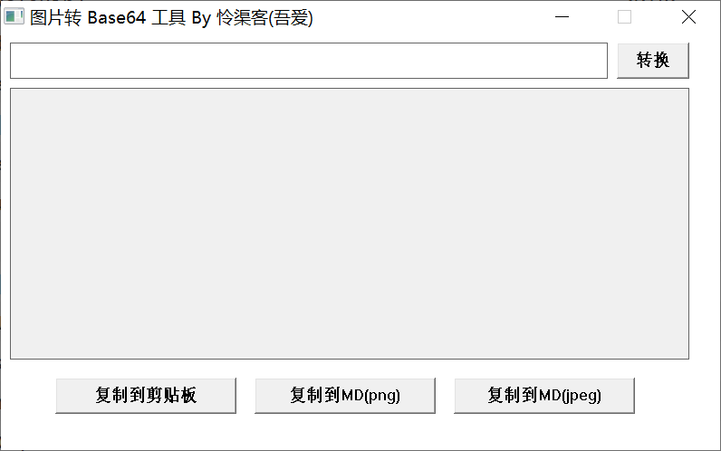

# Img2Base64

图片转Base64编码，可以用于Markdown

## 软件界面

## 开发环境

使用Win32 API开发，IDE为[小熊猫C++](https://royqh.net/redpandacpp/)（小熊猫很好用且轻量，适合小软件开发和初学者学习使用，推荐给大家）。

## 相关帖子

https://blog.csdn.net/m0_47587308/article/details/140923115

